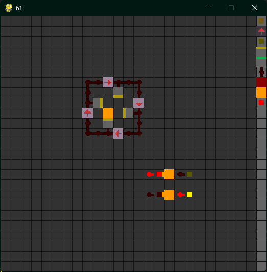

# Minecraft Mechanisms
Python 3.8 redstone system simulation using PyGame

Supported blocks:
- Button
- Repeater
- Lever
- Piston
- Sticky Piston
- Redstone
- Redstone Block
- Solid
- Redstone Torch

